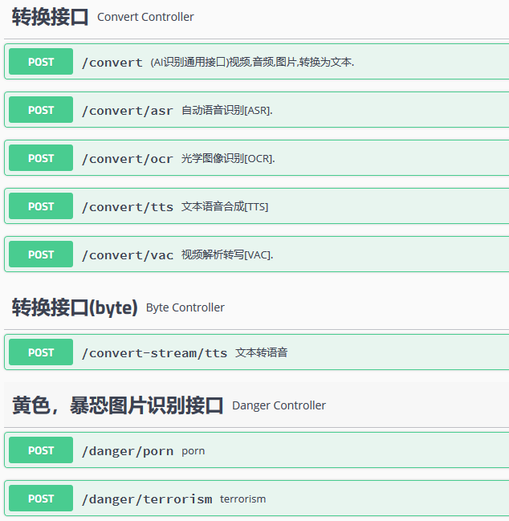

# 多媒体内容识别、语音转写、语音合成服务

> easy convert video audio image to text, or revert text to audio(base64), more features can expected.
Here is [api-docs](http://kbs41.demo.xiaoi.com/kbase-media/swagger-ui.html) which use Swagger2.

>
[](https://travis-ci.org/Yogurt-lei/kbase-media)


## 配置文件说明

**注意启动日志: 当`ocr`引擎使用`abbyy`时,启动是若提示`fineReader engine license` 过期需要再启动一次..**

``` yaml
# convert部分配置
convert:
  # 是否开启每周日1:00am清空上传文件夹
  clean-tmp: true
  # 是否开启异步接口
  enable-async: false
  # 同步接口配置
  sync:
    # 最大上传文件大小
    upload-file-size: 50MB
    # 上传文件存储路径
    output-folder: ./convert/
  # 异步接口设置
  async:
    # 最大上传文件大小
    upload-file-size: 500MB
    # 上传文件存储路径
    output-folder: ./convert/async/
  video:
    vca:
      # 项目依赖于ffmpeg,必须要安装,默认即可
      default: ffmpeg
      ffmpeg:
        # ffmpeg的安装路径
        path: /opt/ffmpeg/ffmpeg-3.0/
        toImage:
          # ffmpeg视频切割图片默认为1帧/5s
          fps: 0.2                                           
  audio:
    # asr引擎配置
    asr:
      # 可选值:shhan:声瀚引擎(私有化部署),baidu:百度引擎
      default: shhan
      # asr接口对音频时间长度有限制,所以此值为切割文件的长度,声瀚为20s/段,百度为60s/段 
      seg-duration: 20 
      #baidu asr config 
      baidu:
        appId: 11067243
        apiKey: iDEvPvY4zT9CzFgYKMQY6eAi
        secretKey: Wkeh8gIbB2LrNBtGwuechG8TUkLlB2TY
      xfyun:
        apiUrl: http://api.xfyun.cn/v1/service/v1/iat
        appId: 5be241a0
        apiKey: da08f42480e67f574a61290717e8f945
      shhan:
        # 声瀚引擎base-url
        base-url: http://172.16.8.103:8177/shRecBase/
    # tts 引擎配置
      tts:
        default: m2
        # tts引擎所支持的单次请求最大文字长度
        max-text-length: 500
        # m2 tts config
        m2:
          base-url: http://222.73.111.245:9090
  image:
    # ocr 引擎配置
    ocr:
      # 可选值 youtu|abbyy|tesseract 私有化部署设置abbyy|tesseract
      default: abbyy
      #tencent youtu ocr tool config
      youtu:
        appId: 10125304
        secretId: AKIDVs45xejwtvmW5SpdkjYGpDUZTIwOp0Hn
        secretKey: a0EHCwgHhgnogMCvUr33uhKl195qSwip
        userId: 1071552744
      # abbyy fineReader engine config
      abbyy:
        path: /opt/ABBYY/FREngine11/Bin
        license: SWTT-1101-1006-4491-7660-4166
      # tesseract config
      tesseract:
        # language package path 设置tessact语言包路径 未设置读取TESSDATA_PREFIX环境变量
        datapath: /opt/tesseract/tessdata
# kbase-monitor 监控配置
spring:
  application:
    name: kbase-media
  boot:
    admin:
      client:
        # kbase-monitor url
        url: "http://172.16.8.143:8888"
        username: admin
        password: admin
management:
  endpoints:
    web:
      exposure:
        include: "*"
  endpoint:
    health:
      show-details: ALWAYS
  server:
    ssl:
      enabled: false
```
## Restful Apis
[http://kbs55.demo.xiaoi.com/kbase-media/swagger-ui.html](http://kbs55.demo.xiaoi.com/kbase-media/swagger-ui.html)



## Thanks For
[Tencent-YouTu](https://github.com/Tencent-YouTu/java_sdk)

[Baidu-AIP](https://ai.baidu.com/docs#/ASR-Online-Java-SDK/top)

[bramp/ffmpeg-cli-wrapper](https://github.com/bramp/ffmpeg-cli-wrapper)

[apache/rocketmq](https://github.com/apache/rocketmq)

[ekoz/ocr-api](https://github.com/ekoz/ocr-api)


## 附:SpringBoot项目开机自启动配置

1. 开机自启文件配置
``` bash
vim /usr/lib/systemd/system/kbase-media.service 增加

[Unit]
Description=kbase-media
After=syslog.target
   
[Service]
Type=forking
ExecStart=/opt/kbase-media/startup.sh
ExecReload=/bin/kill -s HUP $MAINPID
ExecStop=/opt/kbase-media/shutdown.sh
PrivateTmp=true
SuccessExitStatus=143

[Install]
WantedBy=multi-user.target
```

2. startup.sh
``` bash
#! /bin/sh
/usr/local/jdk1.8/bin/java -Xms1024M -Xmx1024M -Xmn384M -Xss256k -jar /opt/kbase-media/kbase-media-1.0-SNAPSHOT.jar --spring.config.location=/opt/kbase-media/application.yml > /opt/kbase-media/logs/stdout.log &
```
*注意使用spring.config.location直接指定springboot配置文件位置*

3. shutdown.sh
``` bash
#! /bin/sh
kill -9 `ps -ef|grep java|grep -v grep|grep kbase-media|awk '{print $2}'`
```

4. 重载配置文件&注册服务&查看console的日志
``` bash
systemctl daemon-reload
systemctl enable kbase-media.service
journalctl -u kbase-media
```

## Docker 部署
**内置`ffmpeg`，配置文件中的`ffmpeg`路径请设置为空**
```
.
├── application.yml
├── convert
│   ├── 066b0d47ba45041bbc287418adace090
│   │   └── 066b0d47ba45041bbc287418adace090.aac
│   ├── 066b0d47ba45041bbc287418adace090.mp4
│   ├── f172d854b2a950f7f12f61ce9cf4aec6
│   │   └── f172d854b2a950f7f12f61ce9cf4aec6.pcm
│   ├── f172d854b2a950f7f12f61ce9cf4aec6.rs
│   └── f172d854b2a950f7f12f61ce9cf4aec6.wav
├── docker-compose.yml
├── Dockerfile
├── log
│   └── spring.log
└── target
    └── dependency
        ├── BOOT-INF
        ├── META-INF
        └── org
```

